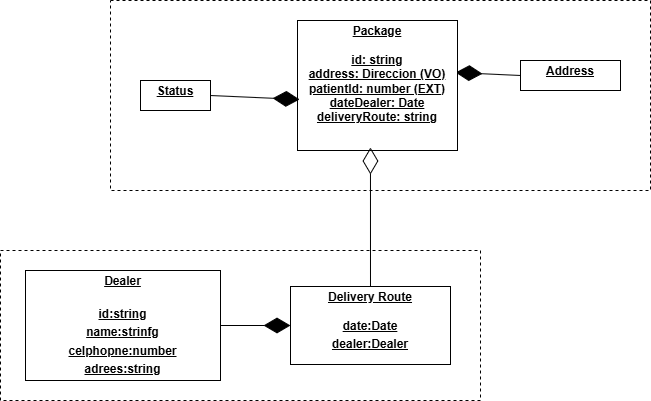

# Microservicio Delivery

## Descripción
Este microservicio gestiona la logística de entrega de paquetes. Permite:
- Crear Dealers (repartidores).
- Crear Paquetes.
- Crear rutas y asociar múltiples paquetes a ellas
- Marcar paquetes como En Tránsito o Entregados

El microservicio está desarrollado aplicando:
- **Domain Driven Design (DDD)**
- **Arquitectura Limpia**
- **CQRS**

No incluye frontend; expone una API REST para ser consumida por otros servicios o aplicaciones.

## Endpoints

| Método   | Ruta                              | Acción                                      |
| -------- | --------------------------------- | ------------------------------------------- |
| **POST** | `/delivery/create-dealer`         | Crear un nuevo Repartidor                   |
| **POST** | `/delivery/create-package`        | Crear un paquete                            |
| **POST** | `/delivery/assign-package`        | Asignar un paquete a un Dealer              |
| **POST** | `/delivery/:id/deliver`           | Marcar paquete como **Entregado**           |
| **POST** | `/delivery/:id/transit`           | Marcar paquete como **En Camino**           |
| **POST** | `/delivery/assign-packages-route` | Crear una ruta y asignar múltiples paquetes |

## Capa de Dominio

### Diagrama de clases

### Entidades
- Dealer
- Package
- DeliveryRoute

### Value Objects
- CellPhone
- Address

### Agregados
- DeliveryRoute (agrega paquetes y dealer)

## Tecnologías
- Node.js / NestJS
- PostgreSQL
- TypeORM
- CQRS (@nestjs/cqrs)
